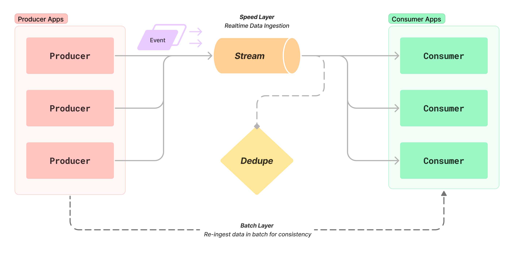

----

Production-ready, High-Availability Indexer Framework for EVM chains. Designed for:

 * Subscribing to on-chain events, with prone to failures or reorgs (e.g. Bridge)
 * ELT (Extract-Load-Transform) of on-chain data into your DB / data lake

### Architecture

### License: MIT
